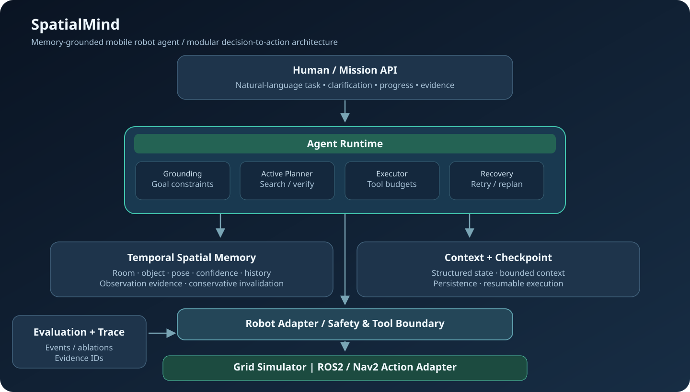
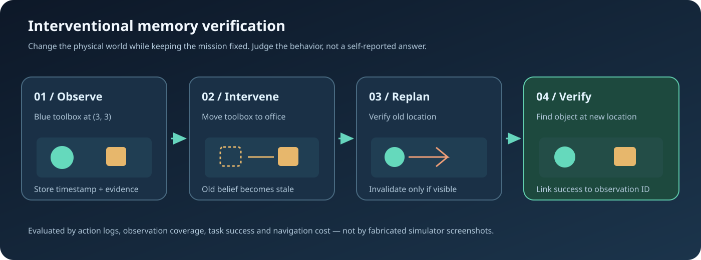

# SpatialMind
### Memory-Grounded Autonomous Mobile Robot Agent

**From language to embodied decisions: observe → remember → plan → act → verify → replan.**

**[Quick Start](#-quick-start)** · **[Architecture](#-system-architecture)** · **[Experiments](#-intervention-benchmark)** · **[Mission Control](#-mission-control)** · **[ROS 2 Integration](#-ros-2--nav2-integration)** · **[中文说明](#-中文说明)**

> **Implementation status (v0.1):** The zero-GPU Python grid simulator, semantic-room navigation, temporal SQLite memory, line-of-sight observation, active-viewpoint search, bounded context, navigation retries, checkpoints, structured telemetry, CLI, benchmark, automated tests and optional browser dashboard are implemented. A ROS2/Nav2 action transport adapter is provided. **This is NOT yet a Gazebo/TurtleBot deployment, an RGB-D perception stack, a VLA model, or a validated physical-robot system.** The distinction is deliberate and auditable.

---

## Why SpatialMind?

Most LLM tool demos assume that tool outputs are complete and that the world stays still. Robots operate under different conditions:

- **The map is not the world.** Objects move, passageways close, sensor observations can be occluded, and localization has uncertainty.
- **A memory is a hypothesis.** “The toolbox was in the lab” is useful historical evidence, not proof that it is still there.
- **Motion is not a text response.** A navigation action must return an observable execution result before the agent declares success.
- **Long-horizon execution needs recovery.** A blocked waypoint, interrupted task or stale target belief must change the next action.
- **Every assertion needs a trace.** Final conclusions should be linked to observations, action results, memory updates and metric definitions.

**SpatialMind studies the decision layer between language reasoning and robotic capabilities**, not replacement of SLAM, collision avoidance, base motion controllers or robot foundation models.

## What can I run today?

| Capability | v0.1 status | Evidence / boundary |
|---|---|---|
| Semantic room navigation | Implemented in grid simulation | Room grounding + BFS path execution |
| Find a named object | Implemented for two reference object classes | Positive simulator observation required |
| Persistent object memory | Implemented | SQLite sightings, position, status, confidence, evidence ID |
| Conservative belief invalidation | Implemented | Only disprove a previous sighting if its cell was actually visible |
| Memory-guided active search | Implemented | Target priors × unobserved coverage / travel penalty |
| Unknown obstacle recovery | Implemented in grid simulation | Discover collision, remember blocked cell, retry alternate path |
| Context selection | Implemented | Hard goal invariants retained under a character budget |
| Checkpoint / resume | Implemented | Task state persisted; live robot/world re-grounding still required |
| Structured event log | Implemented | Navigation goals/results, observation, memory update, plan, conclusion |
| Ablation benchmark | Implemented, small deterministic suite | Full / no-memory / uniform-search reference policies |
| Mission-control dashboard | Implemented (optional FastAPI) | Live grid, last mission trace and remembered objects |
| ROS 2 navigation | **Adapter only** | Nav2 NavigateToPose action and /amcl_pose subscriber |
| Gazebo RGB-D / semantic mapping | **Not implemented** | Requires sensor bridge, 3D perception and semantic map alignment |
| Real robot safety validation | **Not performed** | Hardware e-stop, watchdogs and collision layer required |

## ⚡ Quick Start

**Requirements:** Python 3.11 or newer. No GPU, LLM key, Docker, ROS 2, cloud account or external dataset required for the reference backend.

~~~bash
git clone https://github.com/Benjamindaoson/SpatialMind.git
cd SpatialMind
python -m venv .venv
source .venv/bin/activate            # Windows PowerShell: .venv\Scripts\Activate.ps1
python -m pip install -e .

# 1. Find an object from visual observations
spatialmind demo --instruction "Find the blue toolbox" --show-world

# 2. Run a long-horizon mission with an unseen moved target
spatialmind demo --instruction "Find the blue toolbox" --move-toolbox office

# 3. Navigate to a semantic destination while a doorway is blocked
spatialmind demo --instruction "Go to the meeting room" --obstacle

# 4. Compare intervention scenarios and agent policies
spatialmind benchmark --output artifacts/benchmark.json

# 5. Re-run all executable core tests
python -m unittest discover -s tests -v
~~~

The demo prints JSON with task ID, task status, navigation-action count, replans, failure count and verification observation ID. The event log is stored in **.spatialmind/events.sqlite3**, and long-lived entity memory is stored in **.spatialmind/memory.sqlite3**.

To inspect a specific mission's decisions:

~~~bash
spatialmind trace YOUR_TASK_ID
~~~

The reference parser supports English/Chinese aliases for four semantic rooms and two demonstration object classes. It intentionally asks for clarification instead of pretending to understand unsupported arbitrary instructions. Replace it with an LLM/VLM-backed interpreter when needed, keeping the same typed task contract.

## 🖥 Mission Control

Start the browser UI with:

~~~bash
python -m pip install -e ".[api]"
uvicorn spatialmind.api:app --host 127.0.0.1 --port 8000
~~~

Open **http://127.0.0.1:8000**. The interface is served locally and contains:

1. **Mission input** — issue grounded object-search or semantic navigation tasks.
2. **Live 2D world** — view robot coordinates, obstacles and objects in the deterministic simulation.
3. **Temporal memory** — inspect remembered entities, positions, confidence and missing/observed status.
4. **Event stream** — trace task creation, plan decisions, tool executions, observations, memory changes and verifications.
5. **World interventions** — move the toolbox without secretly updating memory, or block the east doorway before the next mission.

> The dashboard shows the **reference simulator's world**, not an actual SLAM occupancy map. Data may persist in SQLite across requests; simulated world geometry and object poses reset on server restart. Do not expose this development dashboard on the public internet without authentication.

## 🧠 System Architecture

| Layer | Source | Responsibility |
|---|---|---|
| Intent grounding | [language.py](src/spatialmind/language.py) | Conservative command parsing and explicit clarification |
| Decision runtime | [runtime.py](src/spatialmind/runtime.py) | Task lifecycle, observation, verification, recovery, budget, checkpoint |
| Information planner | [planner.py](src/spatialmind/planner.py) | First check credible memory, then choose viewpoints for new observations |
| Temporal memory | [memory.py](src/spatialmind/memory.py) | Persistent sightings, identity, room/pose, confidence, negative evidence |
| Context projection | [context.py](src/spatialmind/context.py) | Preserve goal/robot state, select bounded memory and event history |
| Robot interface | [world.py](src/spatialmind/world.py) | Typed navigate/observe/stop protocol; deterministic test adapter |
| ROS 2 boundary | [ros2_adapter.py](src/spatialmind/ros2_adapter.py) | Nav2 action + localization + external observation JSON contract |
| Observability | [telemetry.py](src/spatialmind/telemetry.py) | Append-only event stream and resumable task snapshots |
| Experiments | [benchmark.py](src/spatialmind/benchmark.py) | Reproducible interventions and policy ablations |
| Browser frontend | [api.py](src/spatialmind/api.py) | Optional local HTTP API and static mission console |

### Decision loop

~~~mermaid
flowchart TD
    A["User instruction"] --> B["Task grounding + constraints"]
    B --> C["Observe and persist evidence"]
    C --> D{"Goal visually verified?"}
    D -- Yes --> Z["Finish with evidence ID"]
    D -- No --> E{"Usable spatial memory?"}
    E -- Yes --> F["Navigate to historical location"]
    E -- No --> G["Select informative viewpoint"]
    F --> H["Robot adapter: navigation action"]
    G --> H
    H --> I{"Action succeeded?"}
    I -- No --> J["Classify obstruction / timeout / unreachable"]
    J --> K["Record failure + bounded replan"]
    K --> E
    I -- Yes --> L["Observe visible cells and objects"]
    L --> M["Update beliefs; invalidate only observable stale claims"]
    M --> D
~~~

**Responsibility split:** The **agent** chooses goals and handles semantic/task failures. **Nav2** (when actually integrated) plans and executes physically safe motion, including its own behavior-tree recovery. The reference grid adapter uses BFS and is not a substitute for Nav2 or a robot safety controller.

### Temporal memory is more than vector search

A memory record stores:

~~~json
{
  "object_id": "toolbox_1",
  "label": "blue toolbox",
  "position": {"x": 3, "y": 3},
  "room": "lab",
  "confidence": 1.0,
  "status": "observed",
  "last_observation_id": 12,
  "sightings": 2
}
~~~

An old observation is invalidated only when the **old location lies inside a newly verified visible region** and the target is absent. Merely failing to see an object elsewhere does **not** mark it gone. The reference implementation models occlusion with grid-wall ray casting; a real robot must estimate observable free space and detection reliability from sensor geometry.

**Important prototype assumption:** Synthetic observations contain stable simulator object track IDs and perfect labels/poses. Real detections require tracking/data association, confidence calibration, projection into the map frame and potentially probabilistic multi-hypothesis reasoning. Those are research milestones, not solved by this v0.1 code.

## 🔬 Intervention Benchmark

Keep the instruction fixed and change the environment. Then inspect whether the **actions and memory transitions** change correctly.

| Scenario | Intervention | Desired behavior |
|---|---|---|
| find_toolbox | Baseline visible object | Conclude only after positive observation |
| moved_toolbox | Store old location; move object to office | Do not trust historical location; reacquire target |
| memory_hint_toolbox | Prior independent robot observation places target in office | Use valid remote memory to reduce unnecessary exploration |
| occluded_toolbox | Move target and add nearby occluder | Avoid false absence conclusions; continue search |
| blocked_corridor | Block east crossing; navigate to meeting room | Recognize obstruction and take a reachable alternate route |
| find_first_aid | Target is in another semantic room | Select viewpoints to find a different object category |

Each scenario is run against three **implemented** policies:

- **full:** Memory-based verification + location priors + active coverage.
- **no_memory:** Prior object sightings are not retrievable during planning (ablation).
- **uniform_search:** Room prior weights are uniform instead of target-informed (ablation).

~~~bash
spatialmind benchmark --output artifacts/benchmark.json
~~~

The report contains per-trial success/failure, action count, path length in **grid steps**, replans and navigation failures, plus policy-level averages. The code computes results at runtime; **no benchmark percentages in this README are fabricated or represented as ROS2/Gazebo/real-world metrics.**

This is a **small deterministic integration benchmark**, not statistically adequate evidence that the method beats contemporary embodied agents. The next research gate is to expand to multiple randomized maps, seeds, target placements and counterfactual conditions and to report confidence intervals.

See [Benchmark Protocol](docs/BENCHMARK.md) for rigor requirements, leakage checks and metrics.

## 🔌 ROS 2 + Nav2 Integration

The optional [Nav2RobotAdapter](src/spatialmind/ros2_adapter.py) implements a synchronous transport bridge:

- Uses **nav2_msgs/action/NavigateToPose** for map-frame navigation.
- Subscribes to **/amcl_pose** and converts a calibrated map pose to grid coordinates.
- Subscribes to **/spatialmind/observation_json** (std_msgs/String) from an **external perception node**.
- Expects object labels, projected map coordinates, detection confidences and explicitly observable cells.
- Cancels outstanding goals on stop/timeout. A ROS safety supervisor is still required.

External observation contract (positions in **meters in the map frame**):

~~~json
{
  "room": "lab",
  "visible_cells": [{"x": 1.2, "y": 1.8}, {"x": 1.3, "y": 1.8}],
  "detections": [
    {
      "label": "blue toolbox",
      "x": 1.2, "y": 1.8,
      "confidence": 0.93,
      "track_id": "tracked_17",
      "room": "lab"
    }
  ]
}
~~~

This transport contract alone does not implement a room semantic map, TF validation, RGB-D segmentation, data association, asynchronous preemption or safety certification. Integrating it into a real robot first requires a map-aligned semantic geometry provider and a sensor-to-map perception pipeline.

For ROS2 Jazzy on Ubuntu 24.04, refer to the official [TurtleBot 4 simulator](https://github.com/turtlebot/turtlebot4_simulator) and [Nav2 NavigateToPose API](https://api.nav2.org/actions/jazzy/navigatetopose.html). **Do not assume installing this repository also installs the ROS distribution.**

## 📦 Project Layout

~~~text
SpatialMind/
├── .github/workflows/ci.yml     # Compile, tests, CLI and benchmark smoke checks
├── docs/
│   ├── images/architecture.svg  # Original editable system drawing
│   ├── images/intervention.svg  # Original intervention drawing
│   ├── ARCHITECTURE.md
│   └── BENCHMARK.md
├── src/spatialmind/
│   ├── models.py                # Typed robot and agent contracts
│   ├── world.py                 # Deterministic navigation and observation backend
│   ├── language.py              # Safe reference command grounding
│   ├── memory.py                # Temporal spatial belief store
│   ├── context.py               # Bounded context projection
│   ├── planner.py               # Active viewpoint search
│   ├── runtime.py               # Observe-plan-act-verify lifecycle
│   ├── telemetry.py             # Event stream and checkpoints
│   ├── benchmark.py             # Interventions and policy comparisons
│   ├── ros2_adapter.py          # Nav2 transport integration boundary
│   ├── api.py                   # Optional local backend
│   ├── cli.py                   # CLI entrypoint
│   └── static/index.html        # Browser mission dashboard
├── tests/test_core.py
├── pyproject.toml
├── LICENSE
└── README.md
~~~

## Engineering Guarantees and Explicit Limitations

**Current contracts**

- A task with no positive target observation must never be marked found.
- A negative sighting is allowed only for previously occupied coordinates inside current visible coverage.
- Navigation results and plan reasons are emitted as structured events.
- Retry budgets are bounded; no silent infinite navigation loop.
- Goal identity and required constraints survive context compression.
- Interrupted tasks retain checkpoint state and can resume in the same stateful environment.
- The simulator never calls an external LLM or downloads model weights.

**Not guaranteed yet**

- End-to-end Gazebo/real-world success, hardware safety or calibrated localization.
- Sensor uncertainty beyond synthetic visibility; realistic perception/tracking and false positives.
- Safe global multi-agent concurrent access to SQLite/HTTP app.
- Restoring world state across process restarts (only task/memory records persist).
- Continuous-voice HRI, sophisticated open-vocabulary language or user-preference learning.
- 3D dynamic scene graphs, VLA policies, reinforcement learning or learning-based planning.

## Roadmap: Make It a Flagship Physical AI Project

| Milestone | Definition of done |
|---|---|
| **M0 — Executable core** | Deterministic robot, memory, search, recovery, trace, benchmark, dashboard — **implemented in v0.1** |
| **M1 — ROS2/Nav2 in Gazebo** | Actual action goals, laser/odometry, SLAM/localization, collision-aware navigation and collected bag replay |
| **M2 — Real visual grounding** | RGB-D projection, tracking, room/object relations, uncertainty calibration and negative-evidence validation |
| **M3 — Long-horizon agent** | Mid-task user corrections, checkpoint consistency, configurable LLM/VLM policies, latency budgets and safe recovery |
| **M4 — Publishable evaluation** | Randomized interventional maps, ablations, confidence intervals, failures, exact cost/latency and no benchmark leakage |
| **M5 — Hardware validation** | Robot-base integration, operator safety gate, real trials, sim-to-real failure taxonomy and reproducible logs |

### What this project is built to demonstrate

**Agent architecture × spatial memory × task-level decision making × robot-system integration × evaluation discipline.** The objective is to make the bridge between digital AI agents and mobile physical AI measurable, rather than to present a visually impressive but unverifiable demo.

## 🇨🇳 中文说明

**SpatialMind = 带时空记忆、主动搜索和失败恢复能力的移动机器人 Agent。** 用户以自然语言发出任务，Agent 通过历史记忆与当前观测决定下一步去哪里；执行失败时进行有预算的恢复；只有真正观察到目标时才能宣布完成。项目内置 SQLite 记忆、任务状态与 Checkpoint、可追溯事件、干预实验、消融评测和浏览器工作台。

**已实现的是无需 GPU 的网格仿真算法原型。** 提供了 Nav2 的 ROS2 适配器，但真实 Gazebo 场景、RGB-D 感知、语义 SLAM 与真机验证仍属于后续开发工作。所有指标必须由实际运行生成，不用虚构成功率。

快速体验：

~~~bash
python -m pip install -e .
spatialmind demo --instruction "寻找蓝色工具箱" --move-toolbox office
spatialmind benchmark --output artifacts/benchmark.json
~~~

---

Designed for reproducibility • Original project diagrams under docs/images • Python 3.11+ • MIT

